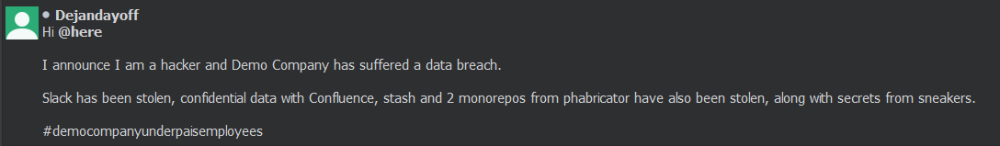
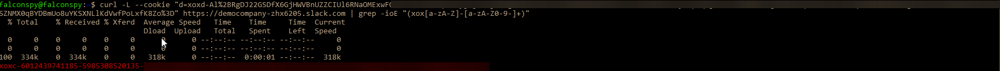
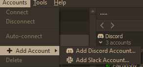
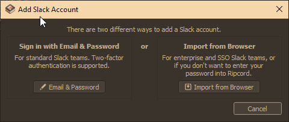
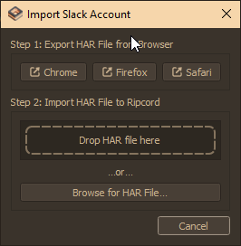
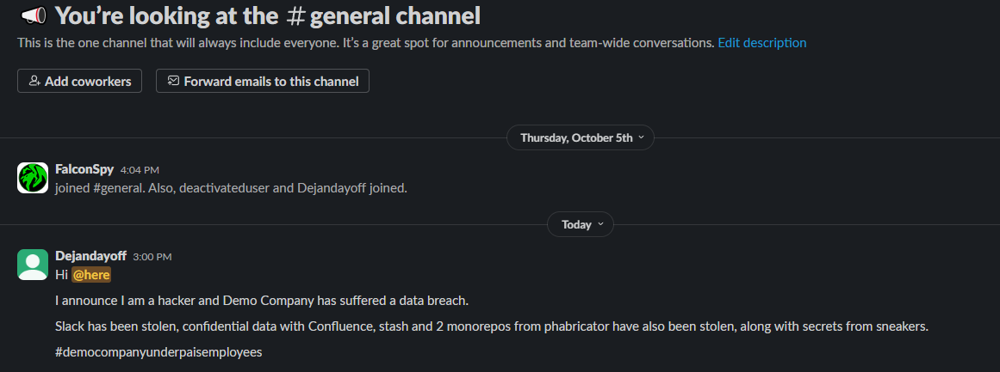
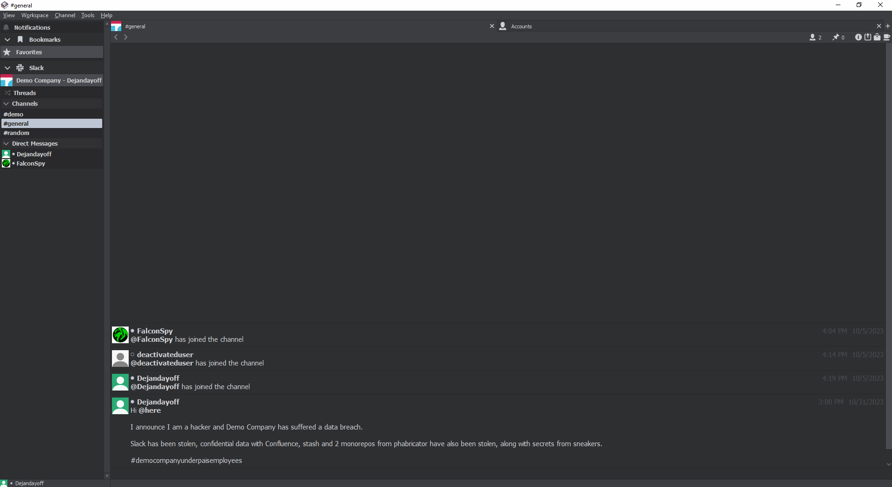

# Introduction 

So you want to impersonate someone on Slack? Maybe claim that you've hacked the next Uber?



To do this some assumptions are made for those looking to follow suit. One major assumption is that you have a C2 agent on the intended victim(s) or were able to steal their Slack cookies. 

# Setup

In order for the impersonation to work properly the following items are needed in somewhat particular order:

* [Ripcord](https://cancel.fm/ripcord/) (3rd Party Discord/Slack client)
* HAR File from Slack (Does not need to be from victim)
* C2 Agent or Slack Cookies stolen from victim
* WorkSpace for Victim
* API Token for Victim


## Grabbing the HAR File

Assuming you've grabbed the proper version of the Ripcord client already, we need to grab a HAR (HTTP Archive) file for Slack from our browser. Ripcord actually instructs you on how to do this via the 3 major browsers:

* [Firefox Instructions](https://cancel.fm/ripcord/static/app_misc/slack_har_howto_firefox_en-US.png)
* [Safari Instruction](https://cancel.fm/ripcord/static/app_misc/slack_har_howto_safari_en-US.png)
* [Chrome Instructions](https://cancel.fm/ripcord/static/app_misc/slack_har_howto_chrome_en-US.png)

You can grab just about any old HAR file. Make a new workspace if you need to or grab one you already belong to since we will be making modifications to the HAR file we just downloaded.

## Slack Cookies Stolen

This part assumes you have stolen the cookies from your C2 agent or via some other means.

We are looking for a particular key:value pair within the cookies in order to make this all come together.

The following key:value pair is what you want to look for with `d` being the key and the value below:

```
d:xoxd-OESA REDACTED
```

Depending on how you acquired the cookie you made need to do some URL Encoding as the cookie should end with `%3D%3D` which equates to `==` decoded.

## Grabbing API Token

For this you need to know the workspace for the victim. In the example workspace created for the purpose of this, the workspace used was `democompany-zhx6205.slack.com`.

Using curl, you can then grab the API token once you know the proper key value pair for the cookie and the workspace. 
```
curl -L --cookie "d=xoxd-Al%REDACTED" https://democompany-zhx6205.slack.com | grep -ioE "(xox[a-zA-Z]-[a-zA-Z0-9-]+)"
```

Assuming you've done everything correctly the API token will start with `xoxc-`. 
```
xoxc-6012439741185-5985308520135-REDACTED
```



## Assembling Our Access

Remember that HAR file we grabbed from earlier? Choose your favorite text editor or string substitution command as we will need it.

Within that HAR file will contain the WorkSpace, Cookie (`xoxd-..`), and API token (`xoxc-..`)

1. Replace the workspace with your intended victim's workspace.
2. Replace the existing cookie with the victims cookie
3. Replace the existing API token with the victims token.

Open up Ripcord and go to Accounts -> Add Account -> Add Slack Account



Select the **Import from Browser** option



Drop/Browse for the HAR file you modified



Regardless of where you copied the original HAR from you'll see some of the old information in there:

* Team Name
* Domain
* User ID
* Team ID
* Token Type

Unless you modified the HAR file to make sure all the information was updated with your victim's info you can just ignore this.

Simply right click your new Slack account within Ripcord and hit connect. Enjoy your access to that individual's Slack account.

## Slack view



## Ripcord View



# Credits

* [Cancel](https://cancel.fm/) for developing [Ripcord](https://cancel.fm/ripcord/)
* [PaperMtn](https://papermtn.co.uk) for [Retrieving and Using Slack Cookies for Authentication](https://papermtn.co.uk/retrieving-and-using-slack-cookies-for-authentication/)
* [Dejan Zelic](https://twitter.com/dejandayoff) for being a guinea pig
* [Topher Timzen](https://twitter.com/ttimzen) for Peer Review & Mentoring
* [r00tkillah](https://twitter.com/r00tkillah) for Peer Review & Mentoring

# Socials

* Discord: @falconspy
* Twitter: [@0xFalconSpy](https://twitter.com/0xFalconSpy)
* BSky: [@falconspy.org](https://bsky.app/profile/falconspy.org)
* Mastodon: [@falconspy](https://infosec.exchange/@falconspy)
* [Github](https://github.com/devzspy)
