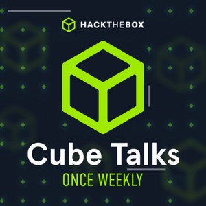

> **Disclaimer:** This transcript was generated with AI assistance and has been manually reviewed and edited. Despite best efforts, some inaccuracies may remain — please use your best judgement when referencing specific statements.

---

**TL;DR / TL;DL:** Covers entering InfoSec via networking & docs, using CTFs/AI for skills, mastering fundamentals over tools, navigating evolving AI landscapes.

**Watch on YouTube:** [Cube Talks – June 26th, 2026](https://www.youtube.com/watch?v=JAkwl1MI4rs)

**Listen on Spotify:** [Cube Talks – June 26th, 2026](https://open.spotify.com/episode/63O7oFgOBCWJVDLAEDplhC?si=wH65t9i-R-yqNhJkETasYg)

---

__FalconSpy:__
Hi everyone. Welcome to this week's CubeTalk. I'm your host, FalconSpy. This is your opportunity to ask our panel of staff and volunteers any questions you might have about Hack the Box, any of the services we offer, as well as InfoSec questions in general. We'll do the best we can to answer as many questions as we can within the next hour. You can use the forward slash CubeTalk command to ask your question to our panel. You can use that same command to also upvote questions to the top of the queue. Questions are first in, first out, unless upvoted. And we'll specify when we answer a question if it was upvoted. We'll introduce everyone here on the panel real quick so that if you have any targeted questions, you can ask them towards them in your question. Then it'll sound like a broken record and we'll go to the questions again. So without further ado, in no particular order, we'll start out with Gillette.

__gill3tt3:__
Hey I'm Gillette. First time here. I got invited by Falcon to join this week. Do red teaming professionally. I've been in the security world for 10 or 15 years and a whole bunch of other weird stuff before that. So happy to be here. Probably can't comment too much on the Hack the Box specifics, but always happy to talk shop. Thanks for having me.

__FalconSpy:__
And then we got Idna.

__idna:__
I'm Idna. I look after defensive content engineering generally from a SOC background full-time at Hack the Box.

__FalconSpy:__
And Atomic Chonk.

__AtomicChonk:__
Hey everybody, Atomic Chonk here. Right now I work as an AI security researcher but I've done a lot of different roles across InfoSec everything from threat hunting to incident response to just offensive security consulting. So yeah happy to chat across any of those areas.

__FalconSpy:__
And we have Ryan.

__0xRy4n:__
I'm Ryan. I am the head of technical operations. I do internal automations and nowadays mostly I do internal tooling development.

__FalconSpy:__
He also writes, it's our It Depends bot that breaks midstream. We got Chad B.

__ChadB:__
Good afternoon. Chad B here. Noob here former blue teamer and red teamer but now just a red teamer. I like Gillette's haircut for some reason and miss Syed already because I'm very happy about the new development with at least the CDSA so far. And I have been putting my red team coworkers on notice that they're up against me in the race to get it.

__FalconSpy:__
I am Falcon Spy one of the community specialists here at Hack the Box also a full-time red teamer elsewhere. Here's the broken record part: use the forward slash Cubetalk command to ask your question to the panel, and you can use that same command to upvote a question. Questions are first in first out unless upvoted. All right and now to... There's no questions loaded so people did not ask questions. Did I think? Yeah there's nothing there.

__ChadB:__
That's a first. The development real quick that I may or may not have been bugging Ryan about for quite a long time actually. But for anyone who doesn't know, I believe it's the CDSA. You can correct me if I'm wrong. I believe the CDSA now falls under USDOD DOW 8140.

__idna:__
Yeah.

__0xRy4n:__
I mean Chad where did you read this Chad?

__ChadB:__
Oh I'm sorry LinkedIn.

__0xRy4n:__
Okay cool. Cool cool cool. Just want to make sure.

__ChadB:__
This is now public. You were correct! Don't scare me like that man. Yeah literally multiple LinkedIn posts. I immediately threw it out to my red team who may or may not do government work. That's a legitimate thing for us now. Now I have a red team and we're all red teamers but we specifically have to be able to speak both languages of course, and you guys have all heard me argue that every red teamer should be able to pass a SOC 1 technical interview and I will bug my coworkers about that and they're probably going to be tired of hearing from me here soon. But that's pretty awesome hopefully there's more to follow but I do see questions now so I'll stop rambling as well.

__FalconSpy:__
All right we actually have some questions coming in so I'll ask those, and then when we run out if we do run out we'll go back to whatever we want to talk about. So what are the consequences of Anthropic's export controls for worldwide security consultants? Will another model reach parity soon? So I guess they're asking with Fable 5 being temporarily disabled for a bit how is that going to look in the future or maybe they're referring to Mythos because right, Fable and Mythos are two different models.

__AtomicChonk:__
Both are yeah. I think immediate consequences that aren't necessarily negative but just ramifications of it is we're going to see a lot of local model booms here soon. Like a lot of people have been relying on the frontier models and paying for those services especially with infrastructure becoming more available right? NVIDIA has the DGX Spark available, RTX Spark coming out later Mac Mini all that stuff, all that infrastructure is coming available for people to host their own local models. I think we're going to see a lot more of that soon with restrictions going on frontier ones right now.

__gill3tt3:__
It's also been interesting to watch some other even older models like Codex 5.5 if you've got the security stuff is fantastic. Haven't had chance to play around with Mythos but I've heard good things about both. Looking at a lot of threat actor activity out in the wild right now, groups are still using 4.5 and 4.6 just crushing it. So implications are maybe we continue lowering barrier to entry for being super effective as models get better but not necessarily world-changing potentially. I'll get my hands on it eventually but feels like a lot of this is shuffling customers over to OpenAI as Anthropic gets hobbled.

__AtomicChonk:__
And the other thing to think about too, regardless of where it's coming from: people in Western countries have some apprehension around open source models coming out of China with DeepSeek and Qwen stuff. But when you give them skills same way you would frontier Western models, equip those open source models with context they need actually perform very well sometimes even outperform given a certain problem set. So we're just going to see more open source model usage going forward.

__FalconSpy:__
All right I got one... Oh go ahead Ryan wait no it's for you Atomic Chonk sorry, since I'm not an AI researcher like I'll screw around some models so maybe you've had better chance looking at obliterated models on Hugging Face? Those have all guardrails removed in theory. Do teams use those along with different skills and MCP servers attached to them?

__idna:__
Yeah no worries.

__AtomicChonk:__
It depends on use case context right like if people weaponize it for nefarious purposes there's been a news story recently where someone got into 14 organizations using an AI workflow without guardrails against arbitrary targets then sure we'll see more of that. But general availability with open source models coming up, Quen or GPT-OSS built by OpenAI is available. I think we're going to drift more as export controls come in closed sources get cracked down on seeing lots more open source models ecosystem some with guardrails without depending how you use them like exploits early 200s when market started it depends what using for right history repeats itself.

__0xRy4n:__
I'll throw a curveball into this: I have access to basically all flagship local models so play GLM 5.2 Kimi 2.7 codes Qwen 39 point 7 billion, quite good wouldn't say compare state-of-art cloud providers fine for most people don't think need Fable or Mythos unless you can throw thing at wall let try again get results even with smaller models if give time keep going needs right first time without messing up that's where come in. With restrictions kicking customers over OpenAI delayed GPT 5.6 whether out of fear same happening not know, US government done this before PGP restricted munitions exports stop exporting countries then resulted printed book sent physically others think safeguards ultimately fail see models better other countries start use those eventually open source catch up people will use that so time-saving measure from government mostly wants do spite will see.

__AtomicChonk:__
And to point Anthropic export controls pushing over OpenAI today White House issued official administrative request asking OpenAI delay release next model, pivoted control them too just shuffling which provider using not local model last thing say most people don't need mythos or fable guy flamethrower lighting cigar meme do really need all that? Probably got right amount sauce kit caboodle to stuff so.

__ChadB:__
What seeing non-US frontier models becoming popular favor US ones can cut supply off works both ways figure out next year.

__gill3tt3:__
Good conversation on Risky Business podcast talking exactly same, a lot open weight models 6-12 months behind now getting closer spicier get way.

__idna:__
All right anyone else?

__FalconSpy:__
I'll move on cool inevitably hit point someone asks hey what working roadmap wise do general disclaimer here don't typically disclose working roadmap give timelines anything like that so don't give away competitors or get people angry miss deadline usually ask question anyway but no one from Academy here answer fall back disclaimer.

__0xRy4n:__
And timeline is at some point past current point.

__FalconSpy:__
When can we oh man what's line Spaceballs? When expect now or no when future just then something I'm butchering missed it again there it is again missed it I'm butchering bad love movie so much remember quote love quotes well all right upvoted question Susan decides load here go plans expanding agentic AI concepts whether offensive defensive Academy beyond COAE probably another disclaimer one we did release HGB Coach follow along some AI stuff not maybe agentic AI concepts HB Coach there now Academy can ask AI help summarize things train give ideas hints heading right direction won't flat out give answer.

__idna:__
Ryan did you work on coach?

__0xRy4n:__
Um yeah only in ways no one would care about behind scenes yes public vision not any.

__FalconSpy:__
Gotcha all right will move then... Uh can we talk how each got into field journey like start with end up whoever wants go first gill3tt3 happy jump new guy go ahead for it.

__gill3tt3:__
Very non-traditional path security world started doing product support big tech company continually a security enthusiast if figure out where handle from buy beer DEF CON sort always background everything doing was security concept kind work lot sysadmin stuff got working at security product company doing pre-sales inevitably 40 people turns into doing mix threat hunting little red teaming figuring EDR evasions selling fun setup years progressed started CTF world hosted one companies worked ability move over their security organization been wearing many different hats past couple internal red teaming stuff.

__idna:__
Thanks Um so I'm old, IT support start out didn't really thing certainly enterprise had no idea cyber security became commonplace more commonplace IT said look firewalls why don't look after security quite steep learning curve discovered enjoyed ended moving full-time security role SOC then got Hack the Box moved red team purple team done incident response few years now at Hack the Box Chad go.

__ChadB:__
I'm right about ready maybe compare ages Edna but also old always been nerd trade electronics technician before computers became main thing we use, technician taking apart circuit boards equipment ran across cyber mentor YouTube noticed Twitch channel of course Twitch more interactive place lead into mayor 11 another streamer UK just started watching got back learning security started own Twitch stream landed Defcon 29 live streaming walking around trying not people camera friend Lord drop watched good friend actually flying Vegas night found little group growing hung out looking transition technician job still streamed couple years blue team person guy flew red team person both said yeah man our hiring new applied both offer letters disbelief real started working two one jobs responsibility goes up what have to go let blue team job though still getting CDSA just stayed saying always be networking network as much study never gotten security field without networking include transition right kind started finding someone stream person working first him getting me a year following two other friends those first networking most important thing.

__0xRy4n:__
That also DEF CON met in-person for first time then led being call cube talk right now absolutely won't talk about... Oh God told story thousand times sure when high school went vocational school spend exactly half time doing trade half normal academics one week math history blah blah another week your trade, computer programming did four years final year started working IT coordinator graduated started system administrator for a year senior sysadmin like need specialize said no he was like have to okay I'll cybersecurity studying moved Florida enrolled into 4-year university COVID happened everybody knew met Florida none lived Florida people go college kid you go back home everybody knew went back had apartment couldn't leave because COVID so friends meet anybody, going do hack the box did for 14 hours a day six months ran company DevOps engineer skipped over... Did hack the box six months every day 14 hours some point Emma community team like Ryan spend much time constantly discord she was like get paid good idea should pay amount time spent on hack the box applied job didn't get cost too money applied different Hack the Box new department called sales engineering gone call asked wanted be in sales gave very good answer entirely made spot because wasn interviewer looked went uh and mind thought he looked through camera soul saw filthy liar panicked messaged now COO company told him knew guy accepted other job going say turn hired anyway okay right did so got job hack the box fast forward six months other job applied one thought hated pulled aside like Hey just want ask why dropped interview process loved Oh thought hated anyway that's how got here series unfortunate events random circumstances Hack the Box been five years now gone...

__idna:__
through 6 different role transitions time think it's you right.

__AtomicChonk:__
Got start in military went ROTC program college into air force cyber effects officer did for four primarily threat hunting cyber protection team after transition over Falcon complete crowd strike got seeing private sector threat chains exploits see wild react started getting taste offensive security figured happy place infosec spectrum joined CrowdStrike red team went Specter Ops specialize further adversary trade craft niche now intersection offensive security AI not attacking models infrastructure orchestration everything run understanding security implications around pretty much specialize doing AI security offensive security that.

__FalconSpy:__
I'm last I'll give too long didn't listen version graduated 2019 infosec degree sorry 2013 joined red team one companies volunteer got OSP certification 2019 found hack the box peers company volunteering left Oracle they like Hey junior pen testing position open apply made way senior pentester switched over red teaming then joined Hack the Box community specialists in 2023 too long to listen version want know always ask DMs give longer been said um next question here where'd it go skips.

__0xRy4n:__
Of course skips hold on I have address ipsec forgot mention six months doing hack the box for hours day all watching ipsec's videos okay there you go happy now?

__FalconSpy:__
10 you know if sex here not panel sick uh so right question... What think AI modern security affect future loaded question.

__AtomicChonk:__
Already seeing implications people using automate workflows biggest differentiator like how much analogy use previous cube talk kind Gundam suit supposed give human more capability than meaty shell gives hop into probably going go well same way if front AI hey Claude make no mistakes hack government know going for you enough expand own expertise think biggest differentiator lot implications AI security not talking all.

__gill3tt3:__
Consider defensive side looking humans empowered upskilled comes whole new threat landscape manage what actually running people's machines network code deployed AppSec challenge IT security blue team sides seeing more threat actors adopting tactics using Claude settings.json files persistence stuff 15 years ago doing Git configs now every single product directly integrated giving RCE service feature aware what actually running important understand empower do.

__ChadB:__
Raises barrier entry new thing have know how use prior getting will always say year from won't main conversation everyone everywhere having figure out use successful act find great success unless others get left behind one two big name companies stop existing.

__0xRy4n:__
Don think add much evaluate full set implications even technology start looking 10 years 20 years what implications like 25 when entire industry professionals lived world did not have AI weaker current capabilities now look same way very first cell phones mobile I no idea looks don't really can advice focus worry too much something ability comprehend try understand implications come along hard prepare future impossible predict.

__gill3tt3:__
Consider what actual value get around tools put Star Trek hat next generation computer solve problem create holograms life whatever still have level ingenuity ask right questions know trying outcomes need actually sit down say hack planet make no mistakes got actually idea concepts want execute obviously autonomy level may problematic Skynet situation end day look empower understand fundamentals how things done.

__idna:__
Otherwise blind leading blind extent.

__FalconSpy:__
Sorry before go next question Ryan brought like he's 6010s Nokia brick phones T9 word snake looking one... That already happened GPT-3.5 when it wasn't scary novelty everyone wow really cool.

__gill3tt3:__
That was hundred percent agreed yeah way down.

__ChadB:__
Yeah next week short turn because want use word normies people super nerds cybersecurity tired hearing form fashion normal ask thing computer going stop getting tired listening honestly once figured alive taking over world can use ask put commas email start tapering soon already wait till start getting inline ads responses code generation great comments.

__idna:__
Yeah.

__ChadB:__
That's stick LLMs local models.

__FalconSpy:__
We'll go next one upvoted question person CPTS CWES CJCA trying get first job studying working CDSA cert thinking getting beginner SOC analyst role help pen testing basically figure doing SOC analyst best way getting into pen transitioning true wrong certs already have specific roles apply right now better path don't know?

__ChadB:__
If security clearance US DOD send resume but what you role should be one can get jump in do best job possible keep looking maybe advanced ones mentioned pretty top notch company work want say recognize OSCP literally gone process hiring people CPTS not that's just is um yeah whoever asked has DOD security clearance to send resume really hate like like that my company looking right now.

__gill3tt3:__
Also sort build on said Chad first job can probably most useful get in cause looking experience mentioned Idna getting into tech job huge number transferable skills pop over leverage security champion organization least bring spin extra context helps move forward once have mix knowledge business side super valuable going together definitely networking help already talked earlier network butt off search waiting long for sure.

__FalconSpy:__
Definitely networking most positions post-graduation through networking that other side right don't networking just called applying places hack the box jobs board jobs.hackthebox.com companies come post positions available looking posted link chat sorry jobs.hackthebox.com also another red team specific positions don know website by red teamer named Nick van Gilder pretty much always latest red team open does lot verification these things posts usually verified not just company harvest resumes.

__gill3tt3:__
Can jump second one want note soft skills side interviews super important relevant to person asked question thing have frequently seen interviewing folks red teaming roles knowledge gap defender side great able come destroy system understanding mitigations detections help teams remediate advise make stronger resilient attack afterwards way behind folks do definitely always thinking both directions.

__idna:__
Okay two ways around know first job manage get type security job sock like mentioned apply things learned CPTS stuff will stand head shoulders above many people assumedly till tier one kind role recognize evil quickly see got trained eye experience doing attacks yourself will help move potentially within organization possibly into wanted do red team more might give opening way.

__ChadB:__
I'm going say well on cooperative assessment right yesterday chat computer client didn't see password spray dropped Splunk query chat like oh need alert... This great thank wait you're red team that worth literally weight gold best thing done new red team job so far drop Splunk query blue team actively drop scene immediately seen did hour ago again every red teamer pass SOC 1 technical interview may say later beat drum day.

__AtomicChonk:__
Yeah biggest value delivered especially active red teaming security consulting hacking way great achieve objective added consult okay mitigate attack path vector that's care exploitable future speaking sides coin really valuable people paying assessments actually thing need do turns out not paying come screw around network like play benefit sorry next question you're good just timekeeping.

__FalconSpy:__
Uh cybersecurity suits for student high school believe recognized competitions CTFs compete isn't go CTF specifically high school yeah depending located national events bring students can remember names head know Canada super involved industry sponsors would say anything everything was local in the question no obviously every single one find group join do learn experiences even advanced ones watching someone moral support case but every actively get into specific with group people networking thing.

__0xRy4n:__
Quick plug Cyber Apocalypse salt crown coming next month.

__AtomicChonk:__
And doing CTF write-ups too goes long way work through entire process use achieve challenge gives little solid understanding worked works beneficial well lot conferences heavily discounted student entry Montreal near North sec fantastic one year show tag along conference both yeah CTF time take look also upcoming ones available high school level right online participate New York RIT host CC DC ISTS obviously college level sure invited good enough or participate plenty out there recognize hard definitely.

__ChadB:__
Don't weeding limit yourself weed any jump in know document stop ranting 10 minutes documentation.

__idna:__
I will move next question give advice newbie start field do CTFs seriously though going through totally fresh find area interesting use great parallel go even don't know solve challenge fine live world point Claude have solve most challenges anyway actually explain walk exploits need run pivots can start building decent repertoire basically same deal watching EpSec video walkthrough interactive fashion super fun sorry Chad think cut.

__ChadB:__
Oh no I'll main rants start learning something like wait too much advice where take keyboard put hands over under wire have EpSec streamers standby specifically jump communities while literally document everything way other people find library stuff YouTube GitHub wherever document someone say can tell studying working know better show go find website YouTube whatever main thing in is literally trust didn't put networking show learned join CTS like talked soft skills part it more people...

__AtomicChonk:__
the, the, the better off will be if getting into pick something interests right don't learn protocol because should technology sort interested research hit wall understanding works get rocks thrown brace good use case AI man wrap head network protocol summon bot break down understand way ultimately doing work helping enable progress forward.

__gill3tt3:__
Yeah want double down too I don't windows world lot Unix adjacent kind guy nightmare quip stuff dropped earlier year cool like concepts Claude please explain Linux terms exploits functioning really good that's maybe do after this... Jumping on more just AI trying get started was OXDF hack the box AI mentor thing skill plugin put into Claude code GitLab lookup HDB dash AI dash mentor for anyone listening recording basically skill slash supposed help tutor will ask questions think doing wrong guide list find writeup obviously retired machines based machine tell try help guide proper direction think like new hack the box coach obviously Academy specifically retired machines don't want sit watch IPSC video obviously do if like watching through videos hands-on approach rubber ducky AI use plugin rubber duck retired.

__idna:__
Anyone else otherwise move quickly add replaying people said stay curious OXDF and IPSC always say root is end got root machine let's say you're machines fan got need stop figure why did work fix hacked systems get around particularly interesting dig find bit more uh next one here... They cybersecurity student learned networking some Python automation deep into types vulnerabilities good security knowledge what would recommend start ground zero become offensive web pen tester have to start over beginning do web?

__idna:__
CWES sorry.

__ChadB:__
I was just saying before Ryan say it no going send out because not pen tester... Gotcha yeah engineering background probably most valuable things actually understand tech stack interact pivot points services communicating architecture side certainly red team get different from pen testing very few times career ever have exploit almost always configuration abusing intended functionality intended access type taking systems thinking approach easy move engineering side offensive role downplay focus just break thing understand works certainly great search good training out there looking stone age OSWE lot stuff modern things super up cert world.

__FalconSpy:__
There's uh PortSwigger damn vulnerable web app different certs plenty free resources definitely use AI now like help understand concepts want do um I use DAMN VULNERABLE WEB APP for a lot beginning yeah Port Swigger Academy out there plenty individual content creators gone created courses code Academy Udemy pick and choose right plenty AtomicChonk Yeah off what Angela both said focus fundamentals maybe take time solidify Gillette's point better understand technology breaks misconfigurations look stuff don't focus Russian root like understand works way help break better.

__FalconSpy:__
All right next question someone experience IT job land pen testing certifications whether OCP CPTS yes answer is going networking still have know talking end day think Atomic just saying throw metasploic module get show tell person interviewing you broke machine client go fix that got show so yes networking point across study document everything didn't technically an IT background worked networks service bunch members email goes along network domain administrator but did SOC analyst pen tester also level at could answer questions actually got running Teapot AWS instance interview he's like well know have seen share screen quickly whoa wait spare time anyone doesn't very basically Teapot honeypots put scene elk stack run own system watch internet attack stuff maybe learn know what talking first network get interview begin okay done before move another hour.

__FalconSpy:__
I'll add story someone worked Offsec little had person took OCP certification dentist not IT start zero hero for OCP so had dentist come take land job field no IT experience just OCP if able back up learned through certifications knowledge great definitely help go long way think one best things particular field don't have degree in the landing job need certifications either obviously they help right kind fortunately part HR bypass filters applying know people refer can obviously bypass HR filters for positions because company want turn down referral employees stop referring stealing words Ipset always say mean if know people hiring manager position knows resume done lot open source projects contribute community doing Hack the Box or competitors whatever see things within field think care don't have IT job experience actual other back up.

__gill3tt3:__
Yeah great example top guys couple years ago one top guys Hacker One doctor doesn't work tech at all just made millions bug bounties no professional experience space alright over thank everyone joining QTalk interested future take look Discord see events happening including QTalks you'll receive alert Friday unless stated otherwise announcements recorded Spotify YouTube next week Tuesday listen there thank everyone seeing.