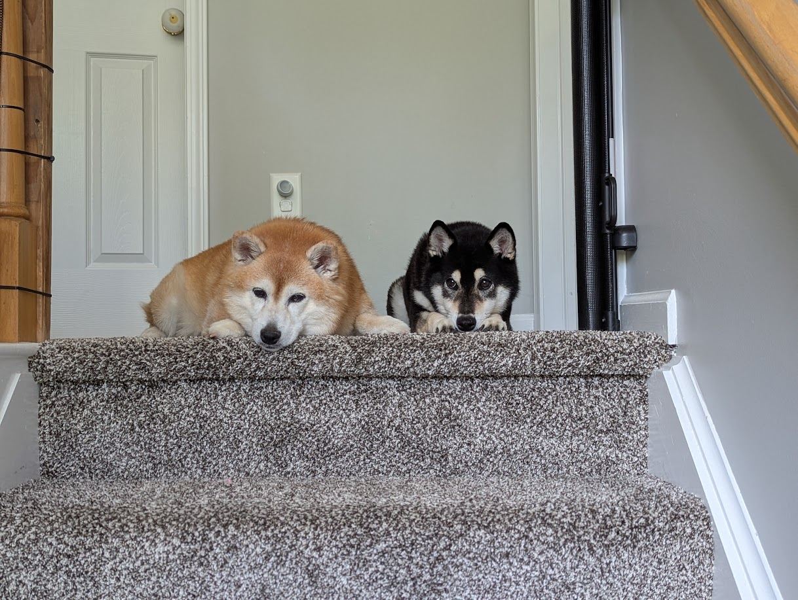

---
# the default layout is 'page'
icon: fas fa-info-circle
order: 4
---

My name is Adam and I have been a Security Engineer with over 9+ years of experience in the Cyber Security field.

Initially I wanted to be a developer/programmer and follow in the footsteps of my father. Upon attending my first year at Rochester Institute of Technology (RIT) I realized that programming day in and day out was not something I particularly enjoyed. 

Around 2011 when the big Sony hack occurred colloquially known as the "2011 PSN Hack" or "2011 Playstation Network outage", my interest in the cyber security field was piqued. The threat actors managed to knock the PS network off for an extended period of time but the main objective was to steal user information. They succeeded in obtaining information about 77 million PSN customers.

The attack on the Playstation Network made me want to become a penetration tester so I too can hack computers, networks, and websites. However, I wanted to use what I would eventually learn to help stop future threat actors from breaching and compromising organizations to steal customer data. 

In my 2nd year at RIT, I switched majors from Computer Science to Information Security and Forensics (ISF). The ISF major was still being developed and most of the content I was taught was conceptual rather than hands on practical. That major/program no longer exists but was replaced with the Cybersecurity (CSEC) degree.

After graduating from RIT in 2013, I was fortunate to have a job lined up, but this position was not in the field. I was hired to manage infrastructure at a large bank. After a year of working at said bank, there was a push for more security where I pivoted to the new team that was tasked with performing encryption, mainly file at rest encryption. I was tasked with setting up the logging, rules, guard points, and much more.  

I was still determined to make it into the cybersec field, so I found out about the OSCP Certification and attempted the course and exam back in 2014. At the time, it was the course was known as Penetration Testing with Backtrack before being switched to Penetration Testing with Kali Linux. Needless to say, I did not do very well in the course exercises and then did not sit for my exam.

After looking to leave my current role to try something new, I leveraged some of my connections to land an opportunity at Intel where I took up the mantle of a Systems Programmer or SysAdmin. My responsibilities at the time were to mange Apache services running on Linux. The scope broadened to running all web based services on Linux and IIS and Windows where I became the team lead for a team of 5. Management at Intel knew I was interested in penetration testing and/or Red Teaming. It turns out Intel had a Red Team and I was approached by said team to see if I can help out on an engagement against by business unit. Starting out I volunteered about 50% of my time to the Red Team engagement while performing my standard duties. I'd help the team learn how to use Cobalt Strike and its AggressorScripting language and write other custom tools for the engagement. Once the engagement concluded and we were successful on our action on objective, I would continue to volunteer 20% of my time to the Red Team.

After joining the Intel Red Team as a volunteer, I met some of my mentors and now peers in the industry:

* [Topher Timzen](https://www.tophertimzen.com)
* [r00tkillah](https://x.com/r00tkillah)
* [Jason Strange](https://jasonstrange.com)

My mentors urged me to go after my OSCP again so I did just that in 2019. This time around I was able to successfully get flags on almost all of the different systems they had to offer. 

I attempted my [first exam sitting](https://falconspy.org/posts/oscp-exam-attempt-1/) and failed due to time management issues. I took a month off and did some [Hack The Box](https://hackthebox.com) to get some extra practice in before attempting again. 

On my [second exam attempt](https://falconspy.org/posts/oscp-exam-attempt-2/), I failed but not due to time management issues. I realized I was inept when it came to attacking Windows systems. 

Between my second and third exam attempt, I took another month off and found [Virtual Hacking Labs](https://falconspy.org/posts/virtual-hacking-labs/) to try and practice my Windows skills. They didn't have that many Windows hosts but it was extra practice.

For the [third exam attempt](https://falconspy.org/posts/oscp-exam-attempt-3/) I finally succeeded in obtaining my OSCP Certification in May 2019.

After obtaining my OSCP Certification I started my job hunt to join the field as a penetration tester or red teamer. I faced several brutal interview practical challenges regarding web apps among other things that I did not have the necessary skills for. Determined, I would study more in between failed interview challenges while continuing my search.

Towards the end of 2019, my mentors reached out to me about a junior penetration tester role opening at Oracle. I gave them my resume, went through the interview process which did not have any challenge, and was hired on in early 2020. I'd begun my career in the field by starting off with some basic assessments while shadowing seniors on the team. Over time I was able to take on my own assessments and work with various service teams.

On the side I like to host and run communities that give back to the cybersec field. I was running a Discord community called `InfoSec Prep` that had a fair amount of providers apart of it. From INE, eLearn Security, Hack The Box, Try Hack Me, and OffSec (formerly Offensive Security).

OffSec approached me in October 2020 to help them create their Discord community. I helped them create, build, and foster a thriving community for people that either liked the company, had their certifications, was looking for help, or just wanted a community to hang out in. I was their Community Ambassador. For 2.5 years I helped their community thrive by putting together weekly office hours, podcasts, taking feedback, and much more.

In 2023 I parted ways with OffSec. 

In 2023, I also received a promotion at Oracle to Senior Offensive Security Engineer. I was given an option to stay with the Security Assessments team or switch to the OCI Red Team. Wanting to be a Red Teamer, I made the switch and have been with that team ever since to present day.

In 2023, I also joined Hack The Box as their Community Specialist. I was asked to help them revamp various programs, bring their community together, and create new programs to help foster their community. I've revamped their contributor program, onboarded new mods, created their Cube Talks (office hour), Cube Cast (podcast), hosted regular trivia events and much more. 

Outside of the CyberSec field, I enjoy gaming either by myself or with friends but mostly online games. I also enjoy archery, photography, tennis, and squash. I have an amazing family of 5 (3 humans and 2 Shiba Inus). 

If you're interested in syncing up you may find me on the following services:
* Discord: `FalconSpy`
* Signal: `FalconSpy.61`
* X/Twitter: [0xFalconSpy](https://x.com/0xFalconSpy)
* BSky: [FalconSpy](https://bsky.app/profile/falconspy.org)
